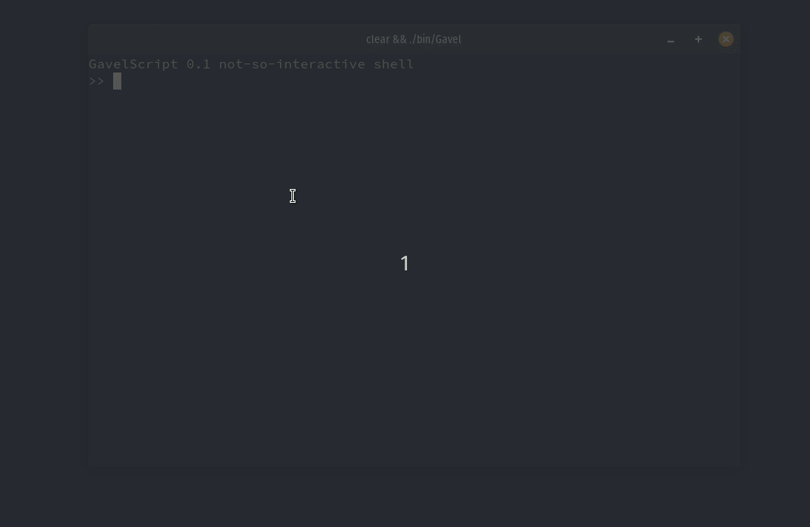

# GavelScript
This is a small single-header embeddable scripting language with an emphasis on [embeddability](#capi) and human-readability. This is still very much an experimental language, so please don't use this in actual projects yet haha.



Some features include:
- [X] Dynamically-typed
- [X] Simple human-readable syntax (Srry Khang)
- [X] Serialization
- [X] User-definable C Functions which can be used in the GavelScript environment
- [ ] Usertypes, basically pointers that can be stored as GValues *In progress!*
- [X] If statements
- [X] Simple control-flow with else, else if, etc.
- [X] While Loops
- [X] Simple Data Structures (Tables!)
- [X] Functions, and return values **Experimental!**
- [X] Debug & Error handling **Experimental!**
- [ ] Order of operations for boolean, and arithmetic operators

> NOTICE: Error-handling is still experimental, don't expect it to be correct 100% of the time. Even line numbers can be wrong. If you run into an issue, 99% of the time it's probably gavel's fault.

# Documentation

## Variables
Variables can be assigned to any type at any point. This is the flexability of having a dynamically-typed language. 

There are 5 main GavelScript types right now.

| DataType | Description | 
| ----------- | ----------- |
| Double | This can store any double, arithmetic can also be done on these |
| String | Stores a length of characters. In the VM these are just a normal C-String. | 
| Boolean | Stores true or false. Can be used in if statments for some simple control-flow |
| C Function | These are C Functions set by your C++ program. |
| Table | These are the basis for data structures in GScript. |
| NULL | This is used for uninitalized variables and for functions that have no return values |

For example, to create a string use
```lua
stringTest = "Hello World!";
```

or maybe you wanna know the answer to life the universe and everything
```lua
doubleTest = 42;
```

There's also support for inversing double values. For example, to inverse doubleTest, just put a negative in front of the identifier.
```lua
print(-doubleTest, " ", doubleTest);
```

## Arithmetic
This lets you do some math to double variables. Order of operations is not yet currently available, and operators are executed from right to left. :(

There are also 4 arithmetic operators available.

| Operator | Description |
| ---- | ---- |
| + | Addition |
| - | Subtraction |
| * | Multiplication |
| / | Division |

So, some simple maths would look like
```lua
mathsTest = 3235*24;
```

## Boolean operators
This lets you ask questions and get their results. 

There are 4 main boolean operators so far.

| Operator | Description |
| ---- | ---- |
| == | Equals to |
| > | Less than |
| < | More than |
| <= | Less than or equals to |
| >= | More than or equals to |

So, some simple booleans would look like
```lua
boolTest = 1 == 1;
```
or even just
```lua
boolTestBetter = true;
```

## Functions 
> NOTICE: Due to some stack limitations, you CANNOT pass more than *255-ish arguments to a C Function*, and *127-ish to a Gavel Function!* Sorry! This will probably change in the future.

This lets you call other chunks of code. There are 2 main types of functions in GavelScript

C Functions and Gavel Functions. Gavel Functions are functions that you define in your script, and the syntax to do so looks like this:
```lua
function fact(i) 
    if (i == 1)
        return i;
    return i*fact(i-1);
end

x = 5; // this is the number we use
print("The factorial of ", x, " is ", fact(5));
```

You can also use return to return a value from a funcion. Eg.
```lua
function fact(i) 
    if (i == 0) then
        return 1;
    end
    return i*fact(i-1);
end

print(fact(5));
```

C Functions are functions that are written in C/C++ and exposed to the GavelScript environment. Here are the default C Functions available

| Identifier | Description | Example |
| ---- | ---- | ---- |
| print | Prints all arguments passed into std::cout | print("hi"); |
| type | Returns a string of the datatype of the GValue passed | print(type(5)); |

So for example, calling print could be as easy as
```javascript
test = "Hello world! I am currently ";
myAge = 15+3;
print(test, myAge, " years old!");
```

Which would output:
> Hello world! I am currently 18 years old!

To see how you can add you own C Functions, look at the [C API](#definec) 

## If statements 
This lets for have some simple control flow over your script.

The syntax for the if statement looks like so
```lua
if (1 == 1) then
    // your script!!
end
```

The () are optional!
```lua
if true then
    // your script!!
end
```

Everything in between 'then' and 'end' will be executed. 

There's also some basic control flow implemented. You can use "else" to control the flow of the if statement. For example:
```javascript
if (false) then
    print("#gavelscriptisoverparty");
else
    print("thank god this worked");
end
```

## Loops
Loops let you repeat a section of your script easily! There is currently only one type of loop implemented.

| type | Description | Example |
| ---- | ---- | ---- |
| while | repeats the script in the following scope while the boolean operation passed in () remains true | while(true) {print("infinite loop!");} |

For example, to repeat a section of your script 5 times you could do something like
```lua
i = 5;
while (i > 0) do
    print(i);
    i = i - 1;
end
```

## Tables

GavelScript has some very basic support for Tables. These function as data storage where a unique key corresponds to any GavelScript value. 

Basic way to create an empty table is to do:
```lua
tblTest = {};
```

If you would like GavelScript to automatically populate the tables, you can do something like:
```lua
tblTest = {"hello", "world!"};
```

Now to index this crafted table you use the [] operators. GavelScript automatically makes the keys 0-(size-1) of the table! So, to get hello you would use the index 0. 
```lua
print(tblTest[0] + " " + tblTest[1]);
```

would output:
"hello world!"

Now you don't just have to use numbers as keys. You can also use anyother datatype (besides CFunctions, Chunks, and Tables (TODO)).

So you can do something like:
```lua
tblTest = {"hello", "world!"};
tblTest["diffKey"] = 1;
print(tblTest[tblTest["diffKey"]]);
```

Which would output:
"world!"

## Comments
These mark comments so you can document your script. These are ignored by the compiler.

```lua
test = "hi!!!"; // makes a variable called test assigned to string "hi!!!"
```

<a name="capi"></a>
# GavelScript C API
> NOTICE: This is constantly changing so please don't use this until I release a stable version!! For a more up-to-date version *check the example [main.cpp!!](src/main.cpp)* (Also tbh the C API for GavelScript sucks rn LOL. I'll eventually add better C API and document everything.)

So, I made this project 1st, to have the bragging rights of "I made my own scripting langauge" and 2nd, so I can embed it in future projects where people might want to add their own behavior to it.
If you think the API should be different or made to be easier, please open an issue!!! 

First of all, to add GavelScript to your project, just include the header! No need to worry about "downloading/compiling libraries" GavelScript is all self-contained and made using pure C++17 features.
```c++
#include "gavel.h"
```

Now, to run a script you'll first have to create a GState. This will hold your stack and direct your program flow.

You can make a GState just like so:

```c++
GState* yaystate = new GState();
```

Now you'll need to generate the chunk for your script. This can be done easily like so:
```c++
GavelCompiler testScript(R"(
    print("Hello world!");
)");
GChunk* mainChunk = testScript.compile();
```

Okay, so now that you have a compiled GavelScript chunk, you'll need to add the base libraries to it.

```c++
Gavel::lib_loadLibrary(yaystate);
```

Then you can run it!
```c++
yaystate->start(mainChunk);
```

The output for that script btw looks like:
"((200*2.5)+3)/2 = 251.5
hi : 500
i should always print! goodbye!!!"

<a name="definec"></a>
## Define custom C Functions
To add your own C Function to be used in a GavelScript, you're going to add it to the enivronment of your mainChunk.

Gavel C Functions also have a specific syntax. They need to return a GValue, and accept both a GState* and int arguments. 
For example the C Function for print looks like:
```c++
GValue* lib_print(GState* state, int args) {
    // for number of arguments, print
    for (int i = args; i >= 0; i--) {
        GValue* _t = state->getTop(i);
        std::cout << _t->toString();
    }
    std::cout << std::endl;

    // returns nothing, so return a null so the VM knows,
    return CREATECONST_NULL();
}
```

now to actually add it to the state's environment, you use:
```c++
yaystate->setGlobal("print", CREATECONST_CFUNC(lib_print));
```

## Serialization
Chunks can also be serialized into a stream of binary data. This can be accomplished using the GavelSerializer and GavelDeserializer classes. For example, 

```c++
GavelCompiler testScript(R"(
    function fact(i) 
        if (i == 0) then
            return 1;
        end
        return i*fact(i-1);
    end

    x = 5;
    print("The factorial of ", x, " is ", fact(x));
)");
GState* yaystate = new GState();
GChunk* mainChunk = testScript.compile();


// testing the deserializer!!
GavelSerializer testSerializer;
std::vector<BYTE> data = testSerializer.serialize(mainChunk);
GavelDeserializer testDeserializer(data);
mainChunk = testDeserializer.deserialize();

// loads print
Gavel::lib_loadLibrary(yaystate);

// runs the script
yaystate->start(mainChunk);
```

This will output "The factorial of 5 is 120".

## Handling Objections

Objections are GavelScripts way of handling errors. They exist for both the compiler and the GState, however they are handled a bit differently depending on which one throw the Objection.

(In the future when I finish usertype support, I'll just make an Objection class that'll handle all of this for you, but until then, here's the hacky version.)

### Compiler Objections

For compiler Objetions, the compile() method will return a NULL GChunk*, when that happens you can call getObjection() to get the string representaton of the Objection, like so:

```c++ 
GState* state = new GState();
Gavel::lib_loadLibrary(state);
GavelCompiler compiler("print(\"ok\";"); // call wasn't closed so it'll throw an objection
GChunk* mainChunk = compiler.compile();

if (mainChunk == NULL) {
    std::cout << compiler.getObjection() << std::endl;
    delete state;
    exit(0);
}
```

### Runtime GState Objections

For Objections that occur during runtime (eg. calling a non-callable datatype) you'll have to handle it a little bit differently. GState*->start(GChunk*) will return false if an Objection occured whil trying to run the chunk. At this point, the Objection is on the GStack as a STRING datatype. GState*->getObjection() will handle grabbing it for you.

So, for example:

```c++ 
GState* state = new GState();
Gavel::lib_loadLibrary(state);
GavelCompiler compiler("a = \"HELLO WORLD\"; b = 2; print(b-a);"); // syntax is correct, however you can't subtract a [STRING] from a [DOUBLE]
GChunk* mainChunk = compiler.compile();

if (mainChunk == NULL) { // this won't happen
    std::cout << compiler.getObjection() << std::endl;
    exit(0);
}

if (!state->start(mainChunk)) { // if an error occured while trying to run mainChunk on the state, 
    std::cout << state->getObjection() << std::endl; // print what happened

    // garbage collect lol
    delete state;

    exit(0);
}
```

## Basic Stack usage
The stack is a member of a GState. Internally it's valuetype is a GStack. This is mainly used internally in the VM, however these are available to use if you are writing a custom instruction or something low level to the VM like that.

First of all, everything is a pointer. Remember that. Want to get a value from the stack? stack.getTop() will return the top most value on the stack (as a pointer GValue*). Want to get the second most top value from the stack? use stack.getTop(1). These ARE NOT CLONES. They are pointers to the actual value on the GStack. Any change to them stays with the stack. If you just wanted the value from the top, use getTop()->clone(). This will call new on the GValue internally. Congrats you now need to keep track of it and use delete when you're finished. Here's some basic examples:

```c++
GValue* value state->stack.getTop(); // got the top-most value
std::cout << value->toStringDataType() << " : " << value->toString() << std::endl; // this will output the datatype && the data
// now, lets pop it.
state->stack.popAndFlush(); // rip value, value is now a dead reference (DON'T USE IT)
std::cout << value->toString() << std::endl; // segmentation fault 
```

Now, lets say maybe you wanted to duplicate the value, do some arithmetic, and push that to the stack. well, that would look like so:

```c++
GValue* value state->stack.getTop();

if (value->type == GAVEL_TDOUBLE) { // we check and make sure it's the right datatype!
    double num = READGVALUEDOUBLE(value); // this is a nice macro i made for you, others exist for all the other datatypes aswell. you're welcome lol
    state->stack.push(num*10); // num*10 is now on the stack!
} else {
    state->throwObjection("Wrong datatype! [DOUBLE] exepected!");
}

// original value is still on the stack, aswell as our new value (if the Objection wasn't thrown)
```