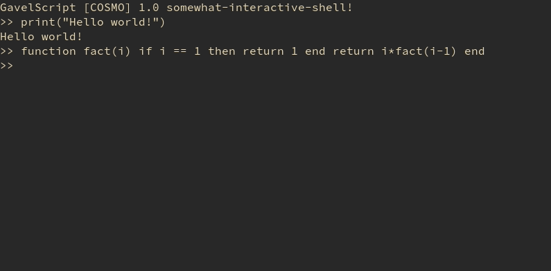
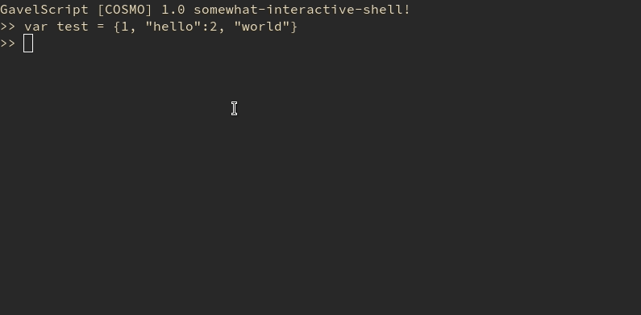

# GavelScript
Gavelscript is a small dynamically-typed functional programming language, all located in a single header library! Why? Well, having this library in a single header makes in stupidly simple for developers to include in their projects! Gavelscript is commited to being as simple as possible for the developer to use, letting you have a powerful scripting langauge for your C++ application without the headaches.

Gavelscript is in active development, however here are some highlights:
- [X] Fast stack-based bytecode virtual machine, Mark & Sweep garbage collector, 
- [X] Human readable syntax
- [X] Built-in serializer and deserializer, allowing you to write compiled Gavelscript functions to files, or precompile scripts in memory
- [ ] Comprehensive and easy to use C++ API

# Documentation
Documentation is being writen, however the C++ API hasn't been finalized yet, so that will be the last to be documented.

Documentation is located in the [wiki](../../wiki/About)! 